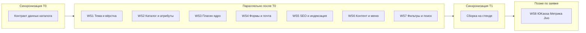

# Параллельные этапы для нескольких агентов (асинхронная разработка)

Цель — разбить поставку сайта по договору б/н от 15.04.2026 на **независимые дорожки** с явными **владельцами файлов**, **входами/выходами** и **точками синхронизации**, чтобы разные агенты работали параллельно без постоянных конфликтов в одних и тех же участках кода.

## Принципы разбиения

1. **Один владелец на область репозитория** — меньше merge‑конфликтов.
2. **Контракты между дорожками** — JSON/CSV схема атрибутов, список slug страниц, макет главной в Figma/MD — а не «устная договорённость».
3. **Интеграция короткими слияниями** — после каждого завершённого пакета: поднять стенд, smoke‑тест, зафиксировать версии плагинов.

---

## Карта зависимостей (что можно параллелить)

**T0 (1 короткий цикл до старта параллели):** зафиксировать список атрибутов товара (производитель, цвет), валюту, НДС/нет, нужны ли доставка и адрес в checkout. Без этого дорожки 2, 4 и 7 рискуют переделками.

**T1:** все дорожки влились в одну ветку, стенд поднят, чек‑лист smoke (главная, каталог, карточка, корзина, одна форма).

---

## Дорожки работ (workstreams)

Ниже: **владение файлами**, **что делать параллельно**, **чего не трогать**, **артефакт для других**.

### WS1 — Тема, главная, адаптив, оболочка Woo

| Поле | Содержание |
|------|------------|
| **Владелец путей** | [`wp-content/themes/avant-shop-child/`](../wp-content/themes/avant-shop-child/) (кроме явной передачи файла другому агенту) |
| **Параллельно с** | WS3, WS4, WS5, WS6 (контент через Customizer/страницы, не правя логику плагинов) |
| **Не трогать** | Код внутри [`wp-content/plugins/avant-site-core/`](../wp-content/plugins/avant-site-core/) |
| **Входы от T0** | Структура главной (блоки), брейкпоинты 320–1920, бренд‑цвета |
| **Выходы для других** | Стабильные CSS‑классы обёрток (`.avant-shop-wrap`, секции главной), README с хуками темы |
| **Критерий готовности** | Главная и типовые страницы без поломки родителя Twenty Twenty-One; нет PHP‑ошибок |

**Бриф агенту (копировать):** «Работай только в `wordpress-avant/wp-content/themes/avant-shop-child`. Не меняй плагины. Сверстай главную по ТЗ, адаптив 320px+, обёртку контента магазина. Любые новые хуки Woo — в `inc/woocommerce.php`.»

---

### WS2 — Модель каталога WooCommerce (атрибуты, тестовые товары, сортировки)

| Поле | Содержание |
|------|------------|
| **Владелец** | Экспорт/импорт **данных** (CSV, XML), скрипты миграции в отдельной папке, например `wordpress-avant/tools/catalog-import/` (создать при необходимости) |
| **Параллельно с** | WS1, WS6 |
| **Не трогать** | PHP темы, кроме согласованного PR «только документация» |
| **Входы от T0** | Список атрибутов, единицы измерения, правила цен/скидок |
| **Выходы** | Файл `docs/catalog-data-spec.md` (slug атрибутов, таксономии) + образец CSV для импорта |
| **Критерий** | На стенде есть категории, товары с вариациями/атрибутами по спецификации, сортировка «цена / дата» проверена |

**Бриф:** «Не редактируй тему. Подготовь спецификацию атрибутов и тестовый импорт WooCommerce. Задокументируй slug для WS7 (фильтры).»

---

### WS3 — Кастомный плагин (`avant-site-core`)

| Поле | Содержание |
|------|------------|
| **Владелец путей** | [`wp-content/plugins/avant-site-core/`](../wp-content/plugins/avant-site-core/) |
| **Параллельно с** | WS1, WS2, WS4 |
| **Не трогать** | Визуальные стили карточки в теме (кроме точечных классов кнопки по согласованию) |
| **Входы** | Решение: «один клик» = заказ Woo или только e‑mail (зафиксировать в `docs/decisions.md`) |
| **Выходы** | Версионированный плагин, инструкция по AJAX/nonce в README плагина |
| **Критерий** | «Один клик» создаёт заказ или отправляет письмо — как согласовано; нет дублей хуков с темой |

**Бриф:** «Только каталог `avant-site-core`. Расширяй «один клик» и будущие REST/интеграции здесь. Тему не меняй.»

---

### WS4 — Формы и доставляемость почты

| Поле | Содержание |
|------|------------|
| **Владелец** | Конфигурация плагина форм (экспорт JSON), настройки SMTP — в `docs/forms-and-smtp-config.md` (без секретов) |
| **Параллельно с** | WS1, WS2, WS3 |
| **Не трогать** | Логику Woo checkout без согласования с WS1 |
| **Входы** | E‑mail получателей, три сценария (ОС, запрос цены, заказ) |
| **Выходы** | Экспорт форм + скриншоты маршрутизации писем; чек‑лист теста доставки |
| **Критерий** | Все три сценария доходят на нужные ящики; спам‑защита согласована |

**Бриф:** «Настрой Fluent Forms / аналог и WP Mail SMTP по [plugin-stack.md](plugin-stack.md). Секреты не коммить. Выход — markdown с шагами и экспорт форм в `wordpress-avant/exports/forms/`.»

---

### WS5 — SEO, ЧПУ, sitemap, robots, noindex стенда

| Поле | Содержание |
|------|------------|
| **Владелец** | Документация `docs/seo-runbook.md` + настройки в Rank Math/Yoast (экспорт настроек если поддерживается) |
| **Параллельно с** | WS1, WS6 |
| **Не трогать** | Разметку главной в теме без согласования (мета — через SEO‑плагин) |
| **Входы** | Финальные URL магазина, политика индексации теста |
| **Выходы** | Runbook: какие шаблоны мета для `product`, `product_cat`, страниц |
| **Критерий** | ЧПУ, sitemap, robots, на тесте noindex |

**Бриф:** «Подготовь SEO runbook и чек‑лист в `docs/`. Не ломай витрину; правки в теме только если нужны микроразметочные хуки — отдельным маленьким PR.»

---

### WS6 — Контент, меню, юридические страницы, медиа

| Поле | Содержание |
|------|------------|
| **Владелец** | Контент‑пакет: `wordpress-avant/content/` (markdown исходников текстов, список страниц и пунктов меню) |
| **Параллельно с** | WS1, WS5 |
| **Не трогать** | PHP темы/плагинов |
| **Входы** | Материалы Заказчика по п. 4.1 договора |
| **Выходы** | `content/menu-structure.md`, `content/pages-list.md` |
| **Критерий** | Меню и страницы согласованы с WS1 (якоря, slug) |

**Бриф:** «Собери тексты и структуру меню в `wordpress-avant/content/`. Не правь код темы.»

---

### WS7 — Фильтры каталога и расширенный поиск

| Поле | Содержание |
|------|------------|
| **Владелец** | Документация конфигурации плагинов `docs/filters-search-config.md` + экспорт пресетов (если есть) |
| **Параллельно с** | WS1, WS2 после **T0** |
| **Не трогать** | Критичные файлы темы; согласовать CSS‑классы сайдбара/оверлея фильтров с WS1 |
| **Входы** | `docs/catalog-data-spec.md` от WS2 |
| **Выходы** | Описание фильтров: цена, производитель, цвет, «со скидкой»; настройка индекса поиска |
| **Критерий** | Фильтры и поиск на стенде с реальными товарами |

**Бриф:** «Дождись slug атрибутов от WS2. Настрой один плагин фильтров и один поиска по [plugin-stack.md](plugin-stack.md). Зафиксируй настройки в markdown + скриншоты.»

---

### WS8 — По заявке: ЮKassa, Метрика, Jivo, вебмастеры

| Поле | Содержание |
|------|------------|
| **Владелец** | `docs/integrations-optional.md` + конфиги без секретов |
| **Параллельно** | После **T1**, не блокирует MVP |
| **Критерий** | Подключено по письменной заявке Заказчика |

---

## Рекомендуемый календарь параллели (логический, не календарные дни договора)

| Фаза | Дорожки |
|------|---------|
| **Неделя A** | T0 → параллельно WS1, WS2, WS3, WS4, WS5, WS6 |
| **Неделя B** | WS7 (после спеки WS2) + доработки WS1 по замечаниям контента WS6 |
| **Неделя C** | T1 интеграция + WS8 по заявкам |

---

## Что нельзя параллелить без договорённости

- Два агента в одном файле `functions.php` без разбиения на `inc/*.php`.
- Одновременная смена **блочного** и **классического** checkout WooCommerce.
- Правки глобальных CSS‑токенов в теме и одновременный тяжёлый редизайн фильтров без согласования классов.

---

## Минимальный набор merge‑правил

1. Ветки Git: `ws/theme`, `ws/catalog-spec`, `ws/plugin-core`, `ws/forms`, `ws/seo`, `ws/content`, `ws/filters-search`.
2. Интегратор (или один агент) мержит в `develop` по очереди после smoke каждой ветки.
3. После каждого merge — фиксировать версии плагинов в `docs/plugin-stack.md` или `STACK.lock` (текстом).

---

## Связь с Приложением 2 (MVP / финал)

- **MVP (7 дней):** достаточно WS1 (срез), WS2 (минимальный импорт), WS3 (по согласованию), WS4 (одна форма + SMTP), WS6 (черновик меню), WS5 (минимум: ЧПУ + noindex стенда). WS7 можно отложить до финала.
- **Финал:** все дорожки + WS7 + документация сдачи из [final-delivery-checklist.md](final-delivery-checklist.md).

Если нужно, следующим шагом можно сгенерировать **отдельные короткие файлы брифов** `briefs/ws1.md` … `briefs/ws8.md` под вставку в чаты агентов.
